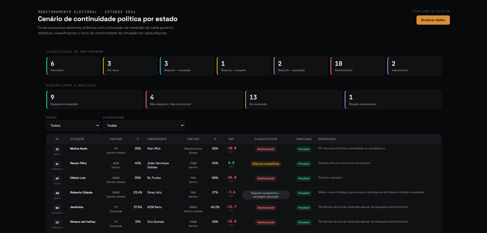
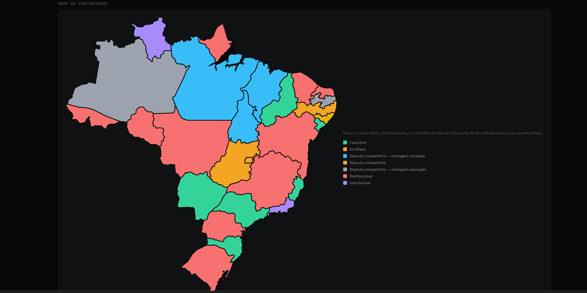

# Monitoramento eleitoral com LLM — Cenário de continuidade política 2026

Dashboard que cruza pesquisas eleitorais públicas com a situação de reeleição
de cada governo estadual brasileiro, classificando o risco de continuidade
da situação em cada uma das 27 disputas para 2026.

**Contexto completo e decisões de arquitetura:** [link do case study no Notion — adicionar depois de publicar]



## Como funciona

O projeto tem três peças, cada uma resolvendo uma etapa diferente do
pipeline — decisão deliberada de usar a ferramenta certa para cada tipo de
problema, em vez de forçar tudo pela mesma via:

| Etapa | Onde roda | Tipo de tarefa |
|---|---|---|
| Curadoria de pré-candidatos por estado (`aba1_situacao_por_estado`) | Claude Cowork, Scheduled Task semanal | Julgamento qualitativo com busca web — precisa de revisão humana |
| Coleta de pesquisas eleitorais brutas | Google Apps Script, gatilho semanal | Scraping determinístico (Wikipédia) |
| Cálculo do gap e classificação de continuidade | Google Apps Script, gatilho semanal | Regra fixa, auditável, sem custo de API |
| Visualização | `dashboard-eleitoral.html`, arquivo único | Lê a planilha ao vivo via Google Visualization API |

```
Cowork (semanal, IA + busca web)
        │  gera .xlsx → revisão humana → cola na planilha
        ▼
aba1_situacao_por_estado  ──┐
                             │
Apps Script #1 (Wikipédia) ─┼──▶  Apps Script #2 (classificação)  ──▶  Classificação de Continuidade
        │                   │              │
   Pesquisas Brutas ────────┘              ▼ gap = % situação − % concorrente
                                    Favorável · Em Risco · Disputa (situação/empate/oposição) · Desfavorável · Imprevisível
                                             │
                                             ▼
                                  dashboard-eleitoral.html (gviz/tq, JSONP)
```

- Um único arquivo `dashboard-eleitoral.html` — abre direto no navegador, sem
  servidor.
- Busca os dados via [Google Visualization API (`gviz/tq`)](https://developers.google.com/chart/interactive/docs/querylanguage),
  usando JSONP — não precisa de chave de API nem de backend intermediário.
- Mapa do Brasil (SVG) integrado à tabela: passar o mouse mostra o detalhe da
  disputa, clicar filtra a tabela por aquele estado.
- Se a planilha não carregar, o dashboard cai automaticamente para um
  conjunto de dados de prévia embutido no próprio arquivo.



## Uso

Abra https://danielterra13-lang.github.io/monitoramento-eleitoral-llm/ no navegador. Por padrão, ele aponta para a
planilha pública deste projeto (`SHEET_ID` fixo no `<script>`, dados 100%
públicos). Para usar com a sua própria planilha, troque as constantes
`SHEET_ID` e `GID_CLASSIFICACAO` no início do bloco `<script>`.

A planilha precisa estar compartilhada como "Qualquer pessoa com o link ·
Leitor", e a aba de origem precisa manter exatamente as 13 colunas geradas
por `apps-script/02-gerar-classificacao-continuidade.gs`.

### Automação semanal (curadoria + coleta)

1. `apps-script/01-atualizar-pesquisas-brutas.gs` — cole no editor de Apps
   Script da planilha, configure um gatilho semanal (Editar → Gatilhos do
   projeto atual).
2. `apps-script/02-gerar-classificacao-continuidade.gs` — mesmo processo,
   com gatilho encadeado logo após o primeiro.
3. `automation/prompt-tarefa-semanal-cowork.md` — prompt da tarefa agendada
   que popula `aba1_situacao_por_estado`. Roda fora do Apps Script (ver
   "Decisões técnicas" abaixo) e exige colar manualmente o resultado
   revisado na planilha.

### Colunas esperadas (`Classificação de Continuidade`)

`UF`, `Estado`, `Candidato Situação`, `% Situação`, `Partido Situação`,
`Maior Concorrente`, `% Concorrente`, `Partido Concorrente`, `Gap`,
`Classificação`, `Confiança do nome`, `Fonte`, `Observação`.

## Decisões técnicas

- **Curadoria da Aba 1 via Scheduled Task do Claude, não via API da
  Anthropic dentro do Apps Script.** A alternativa óbvia seria uma terceira
  função Apps Script chamando a API diretamente — mais "tudo no mesmo
  lugar", mas geraria custo de API recorrente e tiraria a checagem humana do
  meio do caminho. Rodar como Scheduled Task usa a cota do plano de
  assinatura (sem cobrança extra) e devolve um arquivo pra revisão antes de
  qualquer dado entrar na planilha — o tipo de decisão qualitativa (quem é
  "provável" vs. "especulativo" como pré-candidato) que não deveria ser
  gravada sem alguém olhar antes.
- **Classificação de continuidade por regra fixa (gap de pontos
  percentuais), não por LLM.** Essa etapa é 100% determinística e não tem
  ambiguidade — usar um LLM aqui só adicionaria custo, latência e risco de
  inconsistência sem ganho nenhum. Regra: `Favorável` ≥ +10 p.p., `Em Risco`
  entre +6 e +10 p.p., `Disputa competitiva` entre -6 e +6 p.p. (com
  sub-classificação de vantagem), `Desfavorável` < -6 p.p. Limite ajustado
  para 6 p.p. considerando a margem de erro combinada das pesquisas (~3 p.p.
  por candidato).
- **Sem flags/bandeiras de estado.** A versão original buscava um ícone de
  bandeira por linha via uma aba auxiliar. Cortado nesta versão: a UF já
  aparece como badge + região na tabela, e o mapa cumpre o papel visual que
  a bandeira tentava cumprir, sem dependência extra de dado.

## Limitações conhecidas

- Sem paginação — funciona bem até a ordem de milhares de linhas; aqui são
  27, então não é um problema real neste projeto, mas não escala como está
  para uma base municipal, por exemplo.
- A curadoria semanal (Aba 1) depende de alguém abrir o Cowork e colar o
  resultado revisado — não é ponta a ponta automático. Trade-off deliberado
  em troca de custo zero de API e checagem humana; ver "Decisões técnicas".
- Scheduled Task do Cowork só dispara com o computador ligado e o app
  aberto (ou o toggle "Manter ativo" ligado) — se preferir garantia de
  execução mesmo com a máquina desligada, a alternativa é Claude Code na
  nuvem, que roda na infraestrutura da Anthropic.
- Não há autenticação no dashboard — qualquer pessoa com o link e os
  parâmetros da planilha consegue visualizar. Adequado aqui porque os dados
  são públicos por natureza (eleições).

## Aviso

Dados de pesquisas eleitorais públicas (Wikipédia, agregando institutos de
pesquisa). Projeto de portfólio pessoal, sem vínculo com nenhum empregador
atual ou anterior — arquitetura e planilha recriadas do zero para este
repositório.
